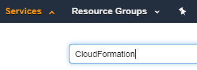
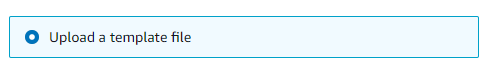
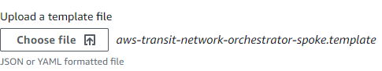
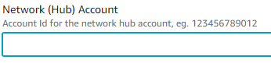
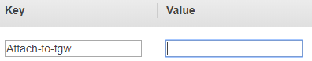

# GSA TGW Customer CloudFormation Template

This CloudFormation template provides you with everything you need setup the required AWS resources to enable an attachment to the GSA TGW Core.

## Getting Started

### Download the CloudFormation Template

To get started you will need to down the CloudFormation template that will configure all of the necessary services and policies to connect to the GSA Transit Gateway.

Follow the link provided below to download and unzip the CloudFormation Template required to deploy the GSA Transit Gateway for your AWS VPC.
Link to Zip: TGW Customer CloudFormation Template

* Navigate to where you downloaded the zip file and extract the zip.
* From the directory where you extracted the zip file navigate to tgw-customer-template-1.0.0 directory as this is where the file you will be uploading in the following steps is located.
  * ***Note:*** template file name is: aws-transit-network-orchestrator-spoke.template

### Deploy the CloudFormation Template

Follow these steps to deploy the CloudFormation services and prepare your GSA AWS account to connect to the GSA Transit Gateway.

* Login to your AWS Account
* Under services select or search for and then select the CloudFormation Service.



* Click the Create Stack button in the upper right hand corner of the console.
  * Be sure to select the With new resources (standard) option.


* Under **Specify Template** select Upload a template file.



Select Upload a template file and select the file CloudFormation template you download previously.



Select Next to continue.


* Name your stack something that you will be able to remember and easily associate with this project.

* Enter the following AWS Account number for Network (Hub) Account parameter:

***Example:***



* Click next to continue and next again to accept defaults on the next screen titled  “Configure stack options”.

* Accept the disclaimer stating that IAM resources might be created with custom names.

* Select the Create Stack button to start the process of deploying the necessary services and policies to allow you to connect to the GSA Transit Gateway.

* Once your stack will goes from to you can continue to the next section.

# Configure the VPC you wish utilize the Transit Gateway

This section will walk you through the process of attaching a VPC to the GSA Transit Gateway.  

* The first requirement will be to create a new VPC and Subnet using the CIDR block provided to you via the Service Now request.
* Once you have your VPC and Subnet configured, all that remains to complete the initial attachment to the GSA Transit Gateway is to add the tag key Attach-to-tgw with no value to the Subnet you wish to have GSA Transit Gateway’s interface to be installed.  
```
Tag: 
  Key: Attach-to-tgw
  Value: NA
```
***Example:***



* Under the Transit Gateway section of the  service VPC you will see the GSA Transit Gateway with a status of available.

